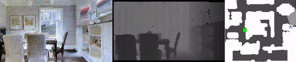

[](https://opensource.org/licenses/Apache-2.0)

<h1 align="center">PointNav-VO</h1>
<p align="center">The Surprising Effectiveness of Visual Odometry Techniques for Embodied PointGoal Navigation</p>

<p align="center"><b><a href="https://xiaoming-zhao.github.io/projects/pointnav-vo/">Project Page</a> | <a href="https://arxiv.org/abs/2108.11550">Paper</a></b></p>


<p align="center">
  
</p>

## Table of Contents

- [Setup](#setup)
- [Reproduction](#reproduce)
- [Plug-and-play](#use-vo-as-a-drop-in-module)
- [Train](#train-your-own-vo)
- [Citation](#citation)

## Setup

### Install Dependencies

```bash
conda env create -f environment.yml
```

### Install Habitat

The repo is tested under the following commits of [habitat-lab](https://github.com/facebookresearch/habitat-lab) and [habitat-sim](https://github.com/facebookresearch/habitat-sim).
```bash
habitat-lab == d0db1b55be57abbacc5563dca2ca14654c545552
habitat-sim == 020041d75eaf3c70378a9ed0774b5c67b9d3ce99
```

Note, to align with Habitat Challenge 2020 settings (see Step 36 in [the Dockerfile](https://hub.docker.com/layers/fairembodied/habitat-challenge/testing_2020_habitat_base_docker/images/sha256-761ca2230667add6ab241a0eaff16984dc271486ec659984ae13ccab57a9c52b?context=explore)), when installing `habitat-sim`, we compiled without CUDA support as
```bash
python setup.py install --headless
```

There was a discrepancy between noises models in CPU and CPU versions which has now been fixed, see [this issue](https://github.com/facebookresearch/habitat-sim/pull/987). Therefore, to reproduce the results in the paper with our pre-trained weights, you need to use noises model of CPU-version.

### Download Data

We need two datasets to enable running of this repo:
1. [Gibson scene dataset](https://github.com/StanfordVL/GibsonEnv/blob/f474d9e/README.md#database)
2. [PointGoal Navigation splits](https://github.com/facebookresearch/habitat-lab/blob/d0db1b5/README.md#task-datasets), we need `pointnav_gibson_v2.zip`.

Please follow [Habitat's instruction](https://github.com/facebookresearch/habitat-lab/blob/d0db1b5/README.md#task-datasets) to download them. We assume all data is put under `./dataset` with structure:
```
.
+-- dataset
|  +-- Gibson
|  |  +-- gibson
|  |  |  +-- Adrian.glb
|  |  |  +-- Adrian.navmesh
|  |  |  ...
|  +-- habitat_datasets
|  |  +-- pointnav
|  |  |  +-- gibson
|  |  |  |  +-- v2
|  |  |  |  |  +-- train
|  |  |  |  |  +-- val
|  |  |  |  |  +-- valmini
```

## Reproduce

Download pretrained checkpoints of RL navigation policy and VO from [this link](https://drive.google.com/drive/folders/1HG_d-PydxBBiDSnqG_GXAuG78Iq3uGdr?usp=sharing). Put them under `pretrained_ckpts` with the following structure:
```
.
+-- pretrained_ckpts
|  +-- rl
|  |  +-- no_tune
|  |  |  +-- rl_no_tune.pth
|  |  +-- tune_vo
|  |  |  +-- rl_tune_vo.pth
|  +-- vo
|  |  +-- act_forward.pth
|  |  +-- act_left_right_inv_joint.pth
```

Run the following command to reproduce navigation results. On Intel(R) Xeon(R) CPU E5-2683 v4 @ 2.10GHz and a Nvidia GeForce GTX 1080 Ti, it takes around 4.5 hours to complete evaluation on all 994 episodes with navigation policy tuned with VO.
```bash
cd /path/to/this/repo
export POINTNAV_VO_ROOT=$PWD

export NUMBA_NUM_THREADS=1 && \
export NUMBA_THREADING_LAYER=workqueue && \
conda activate pointnav-vo && \
python ${POINTNAV_VO_ROOT}/launch.py \
--repo-path ${POINTNAV_VO_ROOT} \
--n_gpus 1 \
--task-type rl \
--noise 1 \
--run-type eval \
--addr 127.0.1.1 \
--port 8338
```

## Use VO as a Drop-in Module

We provide a class `BaseRLTrainerWithVO` that contains all necessary functions to compute odometry in [base_trainer_with_vo.py](./pointnav_vo/rl/common/base_trainer_with_vo.py). Specifically, you can use `_compute_local_delta_states_from_vo` to compute odometry based on adjacent observations. The code sturcture will be something like:
```python
local_delta_states = _compute_local_delta_states_from_vo(prev_obs, cur_obs, action)
cur_goal = compute_goal_pos(prev_goal, local_delta_states)
```

To get more sense about how to use this function, please refer to [challenge2020_agent.py](./challenge_2020/challenge2020_agent.py), which is the agent we used in [HabitatChallenge 2020](https://eval.ai/web/challenges/challenge-page/580/leaderboard/1631#leaderboardrank-1).

## Train Your Own VO

See details in [TRAIN.md](./TRAIN.md)

## Citation

Please cite the following papers if you found our model useful. Thanks!

>Xiaoming Zhao, Harsh Agrawal, Dhruv Batra, and Alexander Schwing. The Surprising Effectiveness of Visual Odometry Techniques for Embodied PointGoal Navigation. ICCV 2021.
```
@inproceedings{ZhaoICCV2021,
  title={{The Surprising Effectiveness of Visual Odometry Techniques for Embodied PointGoal Navigation}},
  author={Xiaoming Zhao and Harsh Agrawal and Dhruv Batra and Alexander Schwing},
  booktitle={Proc. ICCV},
  year={2021},
}
```

